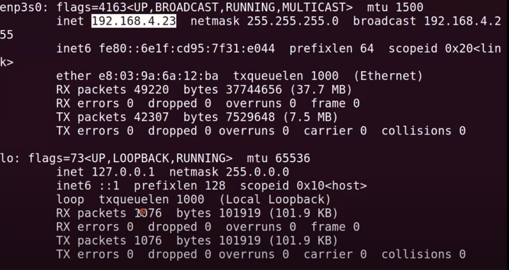

# HPC-cluster-setup

## Description
This repository serves as comprehensive for the initial steps that I performed to setup a HPC CPU cluster . The documentation assumes a setup of 1 master and 2 slaves. You can extend this to whatever configuration you want.

## Step 0 :
Make sure that the usernames of all the nodes are identical. 
Obtain a static IP address for each system and note it. This is crucial, otherwise dhcp assigns a new ip address to each node after reboot and you may have to repeat step 1 every time this happens.

## Step 1 - Install ssh

### 1.1 Run update for all machines:
sudo apt-get update
Then run:
sudo apt-get upgrade
note: press 'y' if asked

### 1.2 Check ip addr. 
Run:
sudo apt-get install net-tools
then, check ip address using:
ifconfig

You may see something like this:

This will be used later.

### 1.3 Install ssh server and client on all machines:
Run:
sudo apt-get install openssh-server
then run:
sudo apt-get install openssh-client

### Create the directory .ssh for all machines:
Run:
mkdir ~/.ssh
then run:
chmod 700 ~/.ssh

### 1.5 Generate rsa key for all machines;
Run:
ssh-keygen -t rsa
then, enter the name of rsa file as: /home/username/.ssh/id_rsa_master (replace id_rsa_master by id_rsa_slave1 for slave1 machine, id_rsa_slave2 for slave2 machine)
continue to enter the password of rsa file.

### 1.6 Copy id_rsa_xxx.pub file
Copy id_rsa_slave1.pub and id_rsa_slave2.pub (from slaves) to master at /home/username/.ssh
Copy id_rsa_master.pub (from master) to slave1 & 2 at /home/username/.ssh
note: the .ssh folder can be viewed by enabling the "show hidden files option" in the file manager.

in master, run:
cat /home/username/.ssh/id_rsa_slave1.pub >> /home/username/.ssh/authorized_keys
cat /home/username/.ssh/id_rsa_slave2.pub >> /home/username/.ssh/authorized_keys

in slave1 and slave2, run
cat /home/username/.ssh/id_rsa_master.pub >> /home/username/.ssh/authorized_keys

### 1.7 Edit file /etc/ssh/sshd_config and restart ssh service for all machines
install gedit.
run:
sudo apt-get install gedit

for all machines, add two new lines in file /etc/ssh/sshd_config and save:
run:
sudo gedit /etc/ssh/sshd_config
a window will appear.
make sure these line are present in the file and are uncommented:
PubkeyAuthentication yes
RSAAuthentication yes
save and close

then, restart ssh service.
run:
sudo service ssh restart

### 1.8 Run test
in master, run:
ssh username@<ip_slave_addr>
note: type yes and enter  password if asked.
after this, you should be able to see the name of the slave1 pc in the command prompt
eg: the command prompt changes from username@master-system:~$ --> username@slave1-system:~$

to exit: write exit and press enter.

similarly test for all machines.
in slave1, run:
ssh username@<ip_master_addr>

similarly test on slave2.

